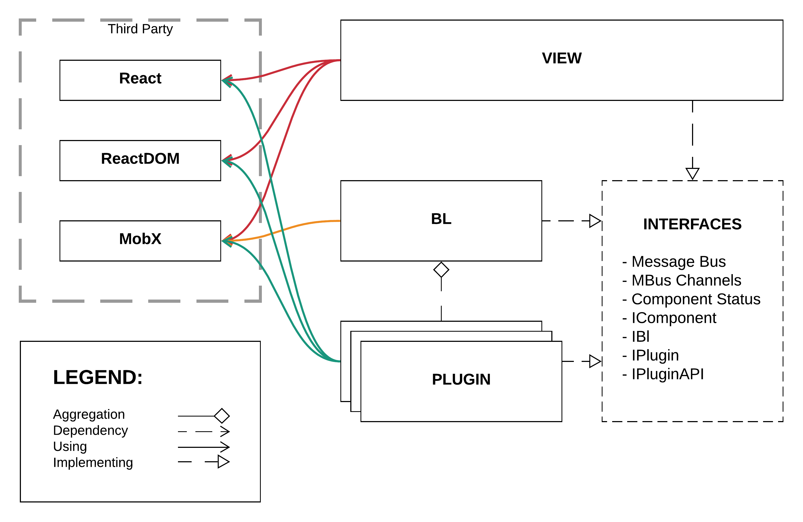

- [plugins-with-typescript-mobx-and-react](#plugins-with-typescript-mobx-and-react)
  - [Installation & Running](#installation--running)
    - [Post compile/test folders](#post-compiletest-folders)
    - [.configs](#configs)
  - [Overview](#overview)
    - [Why do we need such an architecture?](#why-do-we-need-such-an-architecture)
      - [Reduced regression scope](#reduced-regression-scope)
      - [Technology agnosticity](#technology-agnosticity)
      - [Async loading of the packages](#async-loading-of-the-packages)
    - [How do we control version of the suite?](#how-do-we-control-version-of-the-suite)
  - [Tech stack](#tech-stack)
    - [Why TypeScript](#why-typescript)
    - [Why MobX](#why-mobx)
    - [Why React](#why-react)
    - [Why EventEmitter3](#why-eventemitter3)
  - [Running the demo](#running-the-demo)
    - [HEAD section](#head-section)
      - [runtime](#runtime)
      - [jQuery plugin needs](#jquery-plugin-needs)
      - [React plugin needs](#react-plugin-needs)
      - [Vue plugin needs](#vue-plugin-needs)
    - [BODY section](#body-section)
      - [Action buttons](#action-buttons)
      - [main setup](#main-setup)
      - [entities init](#entities-init)
      - [bottom scripts section](#bottom-scripts-section)
  - [Detailed design](#detailed-design)
  - [Real life examples](#real-life-examples)
  - [Summary](#summary)
    - [What this architecture isn't](#what-this-architecture-isnt)
    - [Pros](#pros)
    - [Cons](#cons)
  - [TODO!](#todo)

# plugins-with-typescript-mobx-and-react

This repository contains an implementation of a reference architecture for plugin based UI. Highlights of this implementation are:

- loosely coupled components via interfaces
- independent development and deployability

Solution is developed with TypeScript, React, MobX.

Four plugins variations are provided in this repo:

- Direct DOM manipulation (no carousel)
- [jQuery Carousel](https://albert-cyberhulk.github.io/jQuery-Carousel/example/index.html)
- [React Carousel](https://www.npmjs.com/package/react-responsive-carousel)
- [Vue Carousel](https://www.npmjs.com/package/vueperslides)

## Installation & Running

Install, build, run:

1. ```npm install```
2. ```npm run build:debug``` or ```npm run build:release```
3. ```npm run start```, then open [http://localhost:3000](http://localhost:3000)

To run the unit tests ```npm test:coverage``` or ```npm run test```.

### Post compile/test folders

- ```./coverage``` - contains code coverage report from the unit tests. Created by running the ```npm run test:coverage``` command.
- ```./_bundles``` - contains the compiled packages from running either ```npm run build:debug``` or ```npm run build:releaes```.

### .configs

Files - Purpose

- ```cpuResolver.js``` calculates how many cores we can use for the build and test services. Trying to scale as much as possible to yield faster builds. Not needed for the demo, but part of my own building scripts :).
- ```jest.config.js``` - generic test config for Jest. It is the only reason we have .babelrc in the root folder. Babel is not being used to compile the TS in this project.
- ```jestsetup.js``` - Enzyme needs some initial setup. In addition I am using it to override ```console.error``` to actually throw. Makes for easier testing.
- ```sharedPlugins.js``` - configures the ForkTsCheckerWebpackPlugin for the different builds.
- ```snakeToCamel.js``` - transforms snake-case to camelCase.
- ```tslint.json``` - my idea of what should be configured for the TypeScript compiler to allow.
- ```webpack.{shared|debug|release}.js``` - all the magic of the builds happens here:
  - ```shared``` controls: target, entry, output, externals, resolve and module
  - ```debug``` changes mode to development and adds plugins related to development
  - ```release``` changes mode to production and adds plugins related to production

## Overview



Simple implementation for plugin based solution focused on the UI. Implementation focuses on decoupled developement and independant deployability. For the purposes of this example project all the code is the folder ```./packages```. Consider every "package" a separate project, with it's own developmen and release cycles and repository.

This concept can be implemented with focus on plugins for the Bl as well.

### Why do we need such an architecture?

As projects grow bigger and with more features over time, companies are facing increasing code complexity. This sort of architecture provides the following benefits:

- independent development
- independent deployability
- independent release cycle
- small easy to test bundles of code
- reduced regression scope
- technology agnosticity
- async loading of the packages

#### Reduced regression scope

When we introduce a new plugin that is following the contract, we do not expect regression on the busines logic and view packages. The same goes for new features implementation in the Bl or View packages - no regression is expected on the plugins.

This doesn't mean we should not be doing integration tests. However, we do not need to conduct thorough testing of all aspects of the unaffected packages. For this project the tests suite runs very fast. Consider a system with gigabytes of source code which tests run for hours, maybe even days...

#### Technology agnosticity

As long as the different packages follow the interfaces we are getting the ability to implement different packages with different technology stacks. During projcets growth we are facing two major challanges:

- third party content integration that is following a different tech stack
- new features requiring more modern tech stack/tools

While the plugins are following the provided contract they can have different implementation of their own presentation.

#### Async loading of the packages

Code can be loaded on the page on demand. Async communication via message bus ensures that components can link at any point in time.

### How do we control version of the suite?

It is very easy to follow [semver](https://semver.org/) (MAJOR.FEATURE.PATCH) approach. Consider the version of the interfaces package as the major version.

For interfaces version 1.0.0, we ship packages starting with 1.

Other versioning approaches are also available but are not a focus of this document to discuss.

## Tech stack

This section explains some of the key decisions with regards to dependencies. It is not going to explore the reasons behind choosing **THIS** build tool or **THAT** testing/assertion library.

### Why TypeScript

The point here is not to explain all of the TypeScript's pros/cons nor compare to other type systems, but focus on why it was the tool of choise.

1. It is very easy to create interfaces only packages.
2. Static type checks ensure seamless implementation in production code and unit tests.
3. Easy to transform the code based on browser/module compatibility requirements.
4. Compile-time code improvements.
5. Solutions to different code scaling problems which this architecture is aiming to explore.

### Why MobX

1. MobX is react agnostic. It doesn't care if you use it with React and TypeScript, making this a flexible solution. Very easy to create adapters for event driven implementations.
1. Very little amount of boiler plate code.
1. The redux pattern is just not suitable for this implementation.
1. Provides observable model with @decorators, making for super simple and readable implementations.
1. Internal state mutation provides improved performance for large scale applications dealing with a lot of real time changing data.

### Why React

Two main reasons:

1. Inital implementation for this concept was implemented in a company where React is the view library
1. This demo was written and documented for [http://react-not-a-conf.com/](http://react-not-a-conf.com/) 11.05.2019.

Additional reasons:

1. Functional approach
1. Good rendering performance
1. Good TypeScript integration
1. React is super cool :)

### Why EventEmitter3

The message bus interface was designed based on the NodeJS EventEmitter implementation. The [event-emitter3](https://www.npmjs.com/package/event-emitter3) is designed for compatibility and performance. To quote the developers:

> "EventEmitter3 is a high performance EventEmitter. It has been micro-optimized for various of code paths making this, one of, if not the fastest EventEmitter available for Node.js. The module is API compatible with the EventEmitter that ships by default with Node.js but there are some slight differences..."

In practice any message bus can do the trick as long as there is no forced serialization/deserialization of the passed objects. This design expects us to pass objects with methods that are not serializable.

## Running the demo

After you execute ```npm run start``` and open the browser to the specified address you are going to see a working demo of the code.

In this section I am going over on what is going on inside ```./index.html``` and why.

### HEAD section

For faster demo and independence on internet during presentation, all third party scripts and CSS are downloaded in the ```./third-party``` folder.

#### runtime

This section has all the main dependencies needed for the code to run. All of them are excluded inside the ```./configs/webpack.shared.js```

```html
    <!-- runtime -->
    <script src="/third-party/react.production.min.js"></script>
    <script src="/third-party/react-dom.production.min.js"></script>
    <script src="/third-party/mobx.umd.min.js"></script>
    <script src="/third-party/mobx-utils.umd.js"></script>
    <script src="/third-party/mobx-react.min.js"></script>
    <script src="/third-party/eventemitter3.min.js"></script>
```

#### jQuery plugin needs

Random carousel plugin I found via google. Original code resides on [this link](https://albert-cyberhulk.github.io/jQuery-Carousel/example/index.html).

The CSS and JS were modified a bit because of naming colisions.

```html
    <!-- jQuery plugin needs -->
    <link rel="stylesheet" href="/third-party/cc_styles.css">
    <script src="/third-party/jquery-3.4.0.min.js"></script>
    <script src="/third-party/cc_script.js"></script>
```

#### React plugin needs

First search result in google for [react carousel](https://www.npmjs.com/package/react-responsive-carousel) was used for the React integration demo.

Please note that the source code for the React plugin is much simpler than the rest. The implementation avoids the side effect ridden code and browser API calls that are needed in the other examples.

```html
    <!-- React plugin needs -->
    <link rel="stylesheet" href="/third-party/carousel.min.css">
```

#### Vue plugin needs

I don't know Vue, so it's integration is not much different than the jQuery on. What I see is that if used with TS Vue components could be made injectable in much more robust way. Link to the source of the component - [here](https://www.npmjs.com/package/vueperslides).

```html
    <!-- Vue plugin needs -->
    <link href="/third-party/vueperslides.css" rel="stylesheet">
    <link rel="stylesheet" href="/third-party/vue.css">
    <script src="/third-party/vue.min.js"></script>
    <script src="/third-party/vueperslides.umd.min.js"></script>
```

### BODY section

Body contains markup for few different purposes.

#### Action buttons

Used to start stop different entities in conjecture with the ```runAction``` function. 

```html
    <button onclick="runAction('view', 'activate')">Activate view</button>
    <button onclick="runAction('view', 'deactivate')">Deactivate view</button>
```

```javascript
    function runAction(entity, action) { window[entity][action](); }
```

#### main setup

Only thing we need here is the message bus instance to pass around.

```javascript
    const MBUS = new EventEmitter();
```

#### entities init

For the demo purposes we need access to all entities, thus we setup global vars. In reality these are going to be wrapped inside your module and not be accessible from the global namespace.

```javascript
  // setup global vars for quick access to all instances
  var view, bl, plugin1, plugin2, plugin3, plugin4;
```

WOW, what's with the ```setTimeouts```!?

All the entities are talking in async manner. It doesn't matter in what order we activate them. For the purposes of simulating async/lazy loading on the page the instantiations are wrapped in individual setTimeouts.

Note that below we have plugin1 init before the view and the bl. Plugin2 inits after the view and before the bl. Plugins 3 and 4 init after everything else is running.

```javascript
    window.addEventListener("load", () => {
        setTimeout(() => {
            view = new demo_view.View("app", { mBus: MBUS });
            view.activate();
        }, 100)
        setTimeout(() => {
            bl = new demo_bl.Bl(MBUS);
        }, 500)
        setTimeout(() => {
            plugin1 = new demo_plugin1.Plugin(MBUS);
        }, 0)
        setTimeout(() => {
            plugin2 = new demo_plugin2.Plugin(MBUS);
        }, 250)
        setTimeout(() => {
            plugin3 = new demo_plugin3.Plugin(MBUS);
        }, 750)
        setTimeout(() => {
            plugin4 = new demo_plugin4.Plugin(MBUS);
        }, 1000)
    });
```

#### bottom scripts section

This section loads all the relevant scripts from the compiled packages.

```html
    <script async defer src="/_bundles/demo_bl.js"></script>
    <script async defer src="/_bundles/demo_view.js"></script>
    <script async defer src="/_bundles/demo_plugin1.js"></script>
    <script async defer src="/_bundles/demo_plugin2.js"></script>
    <script async defer src="/_bundles/demo_plugin3.js"></script>
    <script async defer src="/_bundles/demo_plugin4.js"></script>
```

## Detailed design

This section provides a bit more light onto what is inside the different packages. Note that the different plugins implementation may vary! Thus only the general design of a plugin is being explored here.

[Event-emitter3](https://www.npmjs.com/package/event-emitter3) is not listed as dependency of any of the packages as it is compliant with our interfaces. Technically we do not depend on it, and you may notice inside the demo that it is not referenced anywhere. As long as you provide a message bus implementation compatible with our interfaces and requirements, the code is going to continue working as before. It is being imported only inside the unit tests and injected via the constructors in the "runtime" demo.

Check the detailed docs:

- [View](./docs/view.md)
- [Bl](./docs/bl.md)
- [Plugin](./docs/plugin.md)

## Real life examples

Examples of plugin based UI architectures can be found in many places. A lot more advanced version of what is presented here is being used at [SBTech](www.sbtech.com) where I first developed the concept with React and TypeScript. At SBTech we are using this approach for integration with different video streaming providers. A big surprise for us was that many streaming providers are using very big, and very old video players. The provided JS is usualy incompatible with React and TypeScript, not to mention ... huge in terms of KB. Some of the examples require us to load 400+ KB of JS, just to run a stream.

Plugin based systems such as [wordpress](https://wordpress.org), [magento](https://magento.com) are very common in the eCommerce space. Every web application build with such system is a mashup of plugins communicating via shared interface.

## Summary

### What this architecture isn't

TODO

### Pros

TODO

### Cons

TODO

## TODO!

To explain:

1. Expand on the ```./helpers``` folder. Why it is the same for all plugins? We prefer low coupling. Stable packages. Code duplication is ok, coupling is not!
2. Plugin inside plugin.
3. Why plugins cannot communicate between each other?
4. Explain View class life cycle in more details.
