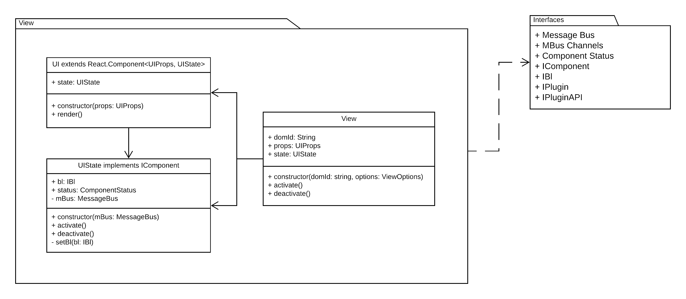
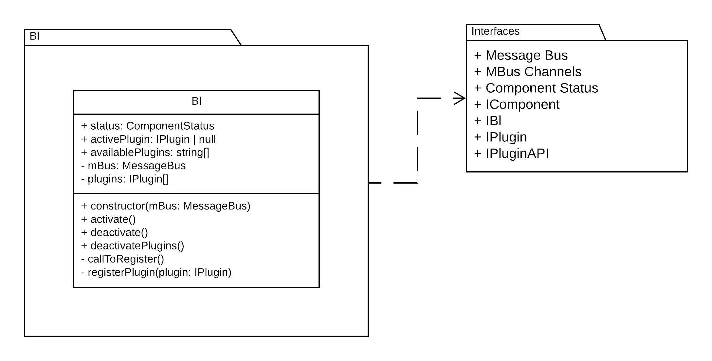

- [plugins-with-typescript-mobx-and-react](#plugins-with-typescript-mobx-and-react)
  - [Overview](#overview)
    - [Why do we need such an architecture?](#why-do-we-need-such-an-architecture)
      - [Reduced regression scope](#reduced-regression-scope)
      - [Technology agnosticity](#technology-agnosticity)
      - [Async loading of the packages](#async-loading-of-the-packages)
    - [How do we control version of the suite?](#how-do-we-control-version-of-the-suite)
  - [Tech stack](#tech-stack)
    - [Why TypeScript](#why-typescript)
    - [Why MobX](#why-mobx)
    - [Why React](#why-react)
    - [Why EventEmitter3](#why-eventemitter3)
  - [Detailed design](#detailed-design)
    - [View](#view)
    - [Bl](#bl)
    - [Plugin](#plugin)

# plugins-with-typescript-mobx-and-react

Plugins based solution for decoupled FE with TypeScript, React, MobX.

## Overview


Simple implementation for plugin based solution focused on the UI. Implementation focuses on decoupled developement and independant deployability. For the purposes of this example project all the code is the folder ```./packages```. However, consider every "package" a separate project, with it's own developmen and release cycles.

Although this implementation is with a focus on pluggable UI components, it can be implemented to put focus on plugins for the Bl.

### Why do we need such an architecture?

As projects grow bigger and with more features over time, companies are facing increasing code complexity. This sort of architecture provides the following benefits:

- independent development
- independent deployability
- independent release cycle
- small easy to test bundles of code
- reduced regression scope
- technology agnosticity
- async loading of the packages

#### Reduced regression scope

When we introduce a new plugin that is following the contract, we do not expect regression on the busines logic and view packages. The same goes for new features implementation in the Bl or View packages - no regression is expected on the plugins.

This doesn't mean we should not be doing integration tests. However, we do not need to conduct thorough testing of all aspects of the unaffected packages. For this project the tests suite runs very fast. Consider a system with gigabytes of source code which tests run for hours, maybe even days...

#### Technology agnosticity

As long as the different packages follow the interfaces we are getting the ability to implement different packages with different technology stacks. During projcets growth we are facing two major challanges:

- third party content integration that is following a different tech stack
- new features requiring more modern tech stack/tools

While the plugins are following the provided contract they can have different implementation of their own presentation.

#### Async loading of the packages

Code can be loaded on the page on demand. Async communication via message bus ensures that they can link at any point in time.

### How do we control version of the suite?

It is very easy to follow [semver](https://semver.org/) (MAJOR.FEATURE.PATCH) approach. Consider the version of the interfaces package as the major version.

For interfaces version 1.0.0, we ship packages starting with 1.

Other versioning approaches are also available.

## Tech stack

This section explains some of the key decisions with regards to dependencies. It is not going to explore the reasons behind choosing **THIS** build tool or **THAT** testing/assertion library.

### Why TypeScript

The point here is not to explain all of the TypeScript's pros/cons nor compare to other type systems, but focus on why it was the tool of choise.

1. It is very easy to create interfaces only packages.
1. Static type checks ensure seamless implementation in production code and unit tests.
1. Easy to transform the code based on browser/module compatibility requirements.
1. Compile-time code improvements.
1. Solutions to different code scaling problems which this architecture is aiming to explore.

### Why MobX

1. MobX is react agnostic. It doesn't care if you use it with React and TypeScript, making this a flexible solution. Very easy to create adapters for event driven implementations.
1. Very little amount of boiler plate code.
1. The redux pattern is just not suitable for this implementation.
1. Provides observable model with @decorators, making for super simple and readable implementations.
1. Internal state mutation provides improved performance for large scale applications dealing with a lot of real time changing data.

### Why React

Two main reasons:

1. Inital implementation for this concept was implemented in a company where React is the view library
1. This demo was written and documented for [http://react-not-a-conf.com/](http://react-not-a-conf.com/) 11.05.2019.

Additional reasons:

1. Functional approach
1. Good rendering performance
1. Good TypeScript integration
1. React is super cool :)

### Why EventEmitter3

The message bus interface was designed based on the NodeJS EventEmitter implementation. The [event-emitter3](https://www.npmjs.com/package/event-emitter3) is designed for compatibility and performance. To quote the developers:

> "EventEmitter3 is a high performance EventEmitter. It has been micro-optimized for various of code paths making this, one of, if not the fastest EventEmitter available for Node.js. The module is API compatible with the EventEmitter that ships by default with Node.js but there are some slight differences..."

In practice any message bus can do the trick as long as there is no forced serialization/deserialization of the passed objects. This design expects us to pass objects with methods that are not serializable.

## Detailed design

This section provides a bit more light onto what is inside the different packages. Note that the different plugins implementation may vary! Thus only the general design of a plugin is being explored here.

[Event-emitter3](https://www.npmjs.com/package/event-emitter3) is not listed as dependency of any of the packages as it is compliant with our interfaces. Technically we do not depend on it, and you may notice inside the demo that it is not referenced anywhere. As long as you provide a message bus implementation compatible with our interfaces and requirements, the code is going to continue working as before. It is being imported only inside the unit tests and injected via the constructors in the "runtime" demo.

### View



View package has the following dependencies:

- [MobX](https://www.npmjs.com/package/mobx)
- [React](https://www.npmjs.com/package/react)
- [ReactDOM](https://www.npmjs.com/package/react-dom)
- Interfaces package (inside ```./packages/contracts```)

### Bl

Business logic package contains a small class that is responsible for plugin:

- discovery
- life cycle
- connection with data layer (currently non is implemented)



Bl package has the following dependencies:

- [MobX](https://www.npmjs.com/package/mobx)
- Interfaces package (inside ```./packages/contracts```)


### Plugin

The plugin package contains two main classes and few small helper functions. For more details check Figure 4. Plugin package.


Plugin's true nature can be seen in Figure 5 (below). The "Presentation" component is implemented in the accepted "React" tech stack. However the "DIV" portion is free to be controlled by custom implementation:

- direct DOM manipulation
- VueJS
- Angular App
- jQuery...


This gives us the ability to seamlessly integrade with our view engine. However we are retaining the option to implement third party components non-complient with our architecture.

Plugin packages in this demo share the following dependencies:

- [MobX](https://www.npmjs.com/package/mobx)
- [React](https://www.npmjs.com/package/react)
- [ReactDOM](https://www.npmjs.com/package/react-dom)
- Interfaces package (inside ```./packages/contracts```)

On Figure 6. you can observe that Plugin provides Presentation following our React integration needs. However inside this Presentation, we have an entity called DIV that is fully controlled based on the business needs. This DIV entity could be controlled with by a jQuery/Vue/React widget.

