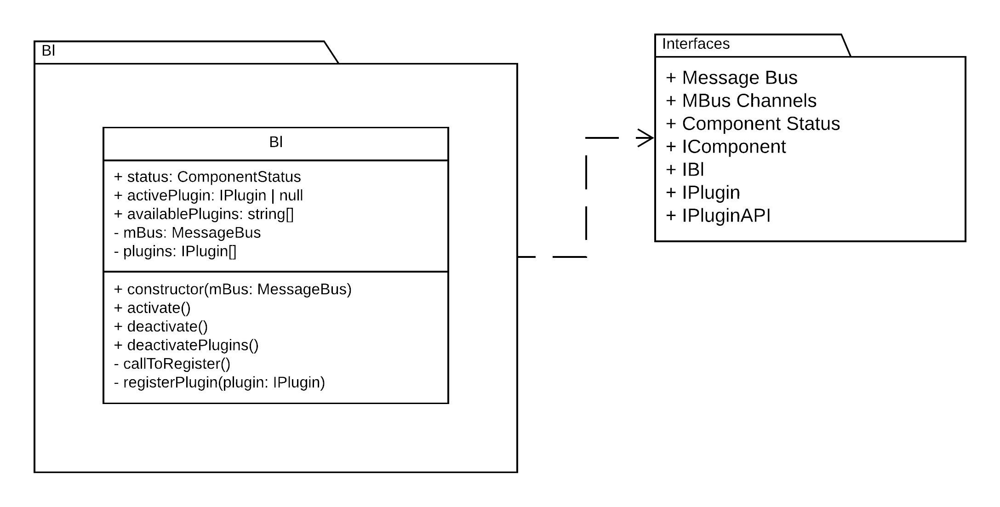

# Bl

- [Bl](#bl)
  - [Multiple Bl instances](#multiple-bl-instances)
  - [Isomorphic Bl](#isomorphic-bl)

Business logic package contains a small class that is responsible for plugin:

- discovery
- life cycle
- connection with data layer (currently non is implemented)



Bl package has the following dependencies:

- [MobX](https://www.npmjs.com/package/mobx)
- Interfaces package (inside ```./packages/contracts```)

Bl is responsible for data delivery and management. View and Plugins are unaware where is the data or how to obtain it. Bl may contain logic for (but not limited to):

- auth
- service discovery
- data serialization/deserialization
- pub/sub
- etc...

Of course all of the above should not be in the same file/class ... Bl is a package and should be split once there is contrast between stable and unstable features inside of it.

Once you get the project to build and run feel free to run ```http://localhost:3000/packages/bl/index.html``` to see how the bl can be developed and tested on it's own.

## Multiple Bl instances

Multiple instance of the Bl package are possible. In the example implementation they are all going to communicate over the same message channels. This means that there is going to be collisions. Implementation could be extended in a way such that there is a message channel prefix passed to the constructor of the Bl class. This prefix is going to be used to ensure concrete instances of the view/bl/plugin packages talking to each other.

## Isomorphic Bl

The way this design is structured implies that the Bl package could communicate via web sockets to the front-end and be completelly offloaded to the backend. Note that in the design the message bus is an interface. Any object conforming to the contract could be passed to the constructor of the Bl class, such that satisfies the need for messages/websocket/sse/etc. communication.

---

Other related docs:

- [View](view.md)
- [Plugin](plugin.md)

[Back to README.md.](../README.md)
