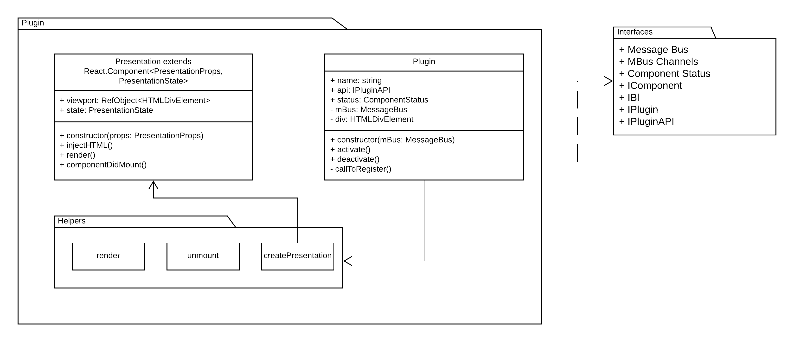
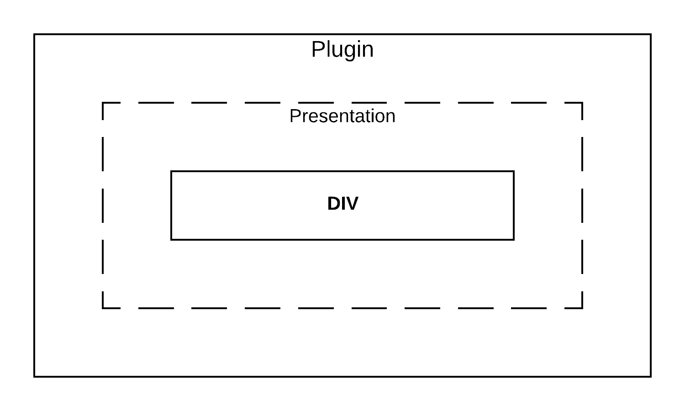

- [Plugin](#plugin)
  - [Do plugins communicate between each other?](#do-plugins-communicate-between-each-other)
  - [Duplicated code](#duplicated-code)
  - [Plugin inside of a plugin](#plugin-inside-of-a-plugin)

# Plugin

The plugin package contains two main classes and few small helper functions. For more details check Figure 4. Plugin package.



Plugin's true nature can be seen in Figure 5 (below). The "Presentation" component is implemented in the accepted "React" tech stack. However the "DIV" portion is free to be controlled by custom implementation:

- direct DOM manipulation
- VueJS
- Angular App
- jQuery...



This gives us the ability to seamlessly integrade with our view engine. However we are retaining the option to implement third party components non-complient with our architecture.

Plugin packages in this demo share the following dependencies:

- [MobX](https://www.npmjs.com/package/mobx)
- [React](https://www.npmjs.com/package/react)
- [ReactDOM](https://www.npmjs.com/package/react-dom)
- Interfaces package (inside ```./packages/contracts```)

On Figure 6. you can observe that Plugin provides Presentation following our React integration needs. However inside this Presentation, we have an entity called DIV that is fully controlled based on the business needs. This DIV entity could be controlled with by a jQuery/Vue/React widget.


There are four different implementations of the plugin. They vary between them as they implement different approaches to the presentation.

The important thing is that all of them are using our React based contract to hook up to our view.

Once you get the project to build and run feel free to run ```http://localhost:3000/packages/plugin{1-4}/index.html``` to see how the different plugins can be developed and tested on their own. Every ```index.html``` for the plugins contains some business logic needed for it's rendering in the HTML. Feel free to hack around it and understand how/why it is working.

I know the names plugin1 to plugin4 are not very imaginative. However, I like the idea of exploring of what hides behind the names :) I promise it is worth it :)

## Do plugins communicate between each other?

In short ... **no!!!**

**Expanded answer:**

The main focus of this architecture is to enable one to deploy new content without the need to redeploy more than one component. As soon as you implement communication between the plugins, even via interfaces you are introducing coupling that is going to have detrimental effect on your system.

As an example I am going to give a very common scenario. Two components are linked by some communication. One gets hotfixed because of production bug. However the hotfix breaks the communication between the two components. Remember the other component is perfectly working and in no need of any work. Regardless you need to patch and test, and deploy them together. This coupling can seriously hurt you delivery performance.

If for some reason it is unavoidable for plugins to share information/methods, you should find a way to abstract away and move this one level up - in this example this would be the Bl package.

## Duplicated code

You may notice there is a folder called helpers inside the plugins. In most of them the helpers are the same and do similar stuff. One might think it is a good idea to export that folder as a separate package... and one would be wrong. Sharing code between plugins is the same as coupling. It is possible for few plugins to use the same helpers library published separately. However, this by definition **must** be a stable package!

Code duplication for simple helper functions is okay, coupling between packages is not!

It is preffereable a plugin to be deployed together with all of it's assets and dependencies, and not to have to deploy another package first (especially one that is shared...) and then the plugin.

## Plugin inside of a plugin

By design nothing stops you to implement this. And maybe there are business cases where it is going to be useful. I haven't found such a recursive case yet.

---

Other related docs:

- [Bl](bl.md)
- [View](view.md)

[Back to README.md.](../README.md)