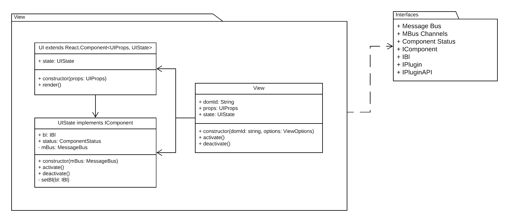

- [View](#view)

# View



View package has the following dependencies:

- [MobX](https://www.npmjs.com/package/mobx)
- [React](https://www.npmjs.com/package/react)
- [ReactDOM](https://www.npmjs.com/package/react-dom)
- Interfaces package (inside ```./packages/contracts```)

View implementation has it's state as an external class. Using MobX for observables. Point attention to the base implementation of the ```ui.tsx```:

All components of this implementation share the same observables pattern. This pattern is usable outside of React. This is preffered so no direct coupling to the view library is going to be present in the implementation. This provides a ```React.Component``` that can observe any properties following the same pattern.

In the example below we are observing not only properties from the BL (```this.state.bl```) package, but also the active Plugin and it's observables (```this.state.bl.activePlugin```).

```typescript
export type UIProps = { state: UIState }

@observer
export class UI extends React.Component<UIProps, UIState> {
    constructor(props: UIProps) {
        super(props);
        // using state class with observable props
        this.state = props.state;
    }

    render() {
        // using data only from the state!
        // it is okay to use this.props... but you won't receive new props
        // as the lifecycle of the application is managed elsewhere
        return (
            <div className="view">
                Bl state: {this.state.bl.status}<br />
                Bl data available: <b>{this.state.bl.data.length}</b> images.
                <hr />
                {this.state.bl.availablePlugins.map((x, i) =>
                    <button
                        key={i}
                        onClick={this.state.bl.activatePlugin.bind(null, x)}
                    >{x}</button>
                )}
                <hr />
                {this.state.bl.activePlugin && this.state.bl.activePlugin.api.ui}
            </div>
        )
    }
}
```

A big difference between React Application... and Application using React as view is that the life cycle is managed by the Application. The View package contains an ```index.tsx``` file that provides integration with the said app.

```typescript
import { UI, UIProps } from "./ui";
import { UIState } from "./state";
import { MessageBus } from "../../contracts";

export type ViewOptions = { mBus: MessageBus }

// There is an application on top that instantiates all of these classes
// and handles routing between pages.
// These classes are .activate() when you navigate to their page
// and .deactivate() when you navigate away.
export class View {
    domId: string
    props: UIProps
    state: UIState

    constructor(domId: string, options: ViewOptions) {
        this.domId = domId;
        this.state = new UIState(options.mBus);
        this.props = { state: this.state };
    }

    activate() { // APPLICATION life cycle method
        const domRef = document.getElementById(this.domId);
        if (domRef !== null) { ReactDOM.render(<UI {...this.props} />, domRef); }
        this.state.activate();
        return this;
    }

    deactivate() { // APPLICATION life cycle method
        const domRef = document.getElementById(this.domId);
        if (domRef !== null) { ReactDOM.unmountComponentAtNode(domRef) }
        this.state.deactivate();
        return this;
    }
}
```

Once you get the project to build and run feel free to run ```http://localhost:3000/packages/view/index.html``` to see how the view can be developed and tested on it's own.

This powerful abstraction allows us to lift up the state of any component and the entire application to a level where it can be injected. When you need to move your code base to another view library or whatever package is affected, you can do that with minimum damage to the system.

---

Other related docs:

- [Bl](bl.md)
- [Plugin](plugin.md)

[Back to README.md.](../README.md)